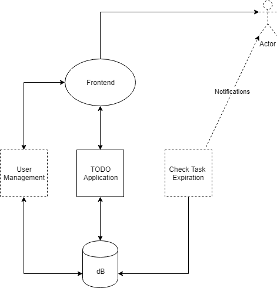
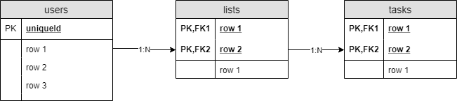

# "TODO" REST API

RESTful API for a TODO application.

The application starts and http endpoint with the API in the port 8080.

## System Architecture



This applications is meant to be used in a microservices architecture. It´s stateless so it can scale out just adding more application in parallel and load balancing the requests.

It uses a datastore, in this case a MariaDB database, so the data can  persist.

User management is out of the scope of this project, this implies deal with password management and meet security requirements and there are different projects much more mature that can provide it.

## Features

* User authorization: TODO app assumes that there is a user table in the database and use the authentication headers to link the TODO lists to the authenticated user.
* Tasks priorization
* Tag filtering

## Database Schema

The application uses the following database scheme and relationships



The table `users` is not handled by the TODO application.

```
CREATE TABLE users (
    id INT PRIMARY KEY AUTO_INCREMENT,
    username VARCHAR(50) NOT NULL,
    UNIQUE(username)
);
```

Each user can have multiple lists, and each list can have multiple tasks

```
CREATE TABLE lists (
    id INT PRIMARY KEY AUTO_INCREMENT,
    title VARCHAR(50) NOT NULL,
    user_id int not null, foreign key (user_id) references users(id)
);
CREATE TABLE tasks (
    id INT PRIMARY KEY AUTO_INCREMENT,
    title VARCHAR(50) NOT NULL,
    description VARCHAR(250) NOT NULL,
    tags VARCHAR(250),
    position INT,
    completed boolean not null default 0,
    list_id int not null, foreign key (list_id) references lists(id)
);
```

## API REFERENCE

In order to allow API versioning we consider the following base URL: `/api/v1`

### Resources types

#### Lists

Each user can create and delete TODO lists

##### Resources

```
type list struct {
	ID       int    `json:"listId"`
	Title    string `json:"title"`
	Username string `json:"username"`

}
```

##### Methods

* list `GET /user/me/lists`  Returns all the authenticated user's task lists.
* insert `POST /user/me/lists` Creates a new task list for the authenticated user
* update `PUT /user/me/list/{listId}` Updates the authenticated user's specified task list.
* delete `DELETE /user/me/list/{listId}` Deletes the authenticated user's specified task list.

#### Tasks

Each TODO list is composed by tasks that can be created, updated, deleted by users

##### Resources

```
{
type task struct {
	ID          int    `json:"taskId"`
	Title       string `json:"title"`
	Description string `json:"description"`
	Tags        string `json:"tags"`
	Position    int    `json:"position"`
	Completed   bool   `json:"completed"`
	ListID      int    `json:"listId"`
}
```

##### Methods

* list `GET /lists/{listId}/tasks` Returns all the tasks in the specified list
    Allow to query tasks by tag  `tasks?query=tag%20eq%20'test'`
* get `GET /lists/{listId}/tasks/{taskId}` Returns the specified task
* insert `POST /lists/{listId}/tasks/` Creates a new task in the the specified list
* update `PUT /lists/{listId}/tasks/{taskId}` Updates the specified task
* delete `DELETE /lists/{listId}/tasks/{taskId}` Deletes the specified tasks

## References

[Building a REST API in golang using gorilla mux and mysql](https://medium.com/@kelvin_sp/building-and-testing-a-rest-api-in-golang-using-gorilla-mux-and-mysql-1f0518818ff6)


## Testing

1. Deploy a database

docker run -d --rm -p 3306:3306 --name todo-db -e MYSQL_ROOT_PASSWORD=password -d mariadb:10.3

2. Create the database schema

docker exec -i todo-db mysql -uroot -ppassword < create_db.sql

## TODO

- [ ] Allow application configuration(listening port, database connection, ...)
- [ ] APIv2 with new features
